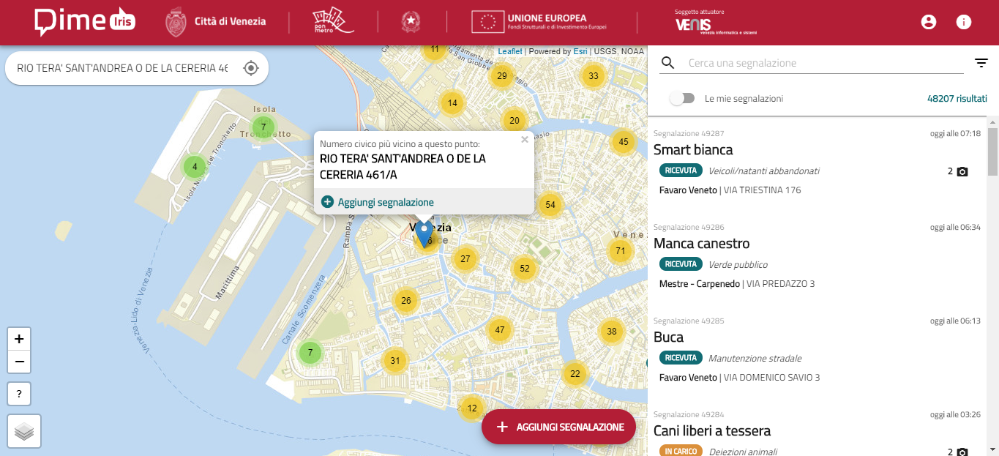

# IRIS 2
> Sistema per consentire ai cittadini di segnalare problemi di manutenzione urbana nel territorio e contribuire così alla loro soluzione

## Immagini e GIF



# Indice
-  [Come iniziare](#come-iniziare)

-  [Come contribuire](#come-contribuire)

-  [Licenza](#licenza)

# Come iniziare  

## Dipendenze
 - NodeJS
 - Workbox (`npm i --g workbox-cli`)
 - Backend capace di risolvere le richieste del frontend (il codice verrà condiviso entro il 10/10/2019)

## Come installare
```
    git clone https://Comune_Venezia@bitbucket.org/Comune_Venezia/iris_frontend.git
    npm i
    npm start
```


# Come contribuire

## Struttura delle directory / branch
 - public: *Cartella che contiene i file statici del progetto*
 - src: *Cartella che contiene i file necessari all'applicazione che verranno compilati in fase di build*
 - .env: *Variabili di ambiente del progetto*
 - .env.production: *Variabili di ambiente usate soltanto in produzione*
 - server.js: *Server Node da eseguire in produzione*
 - workbox-config.js: *Impostazioni relative a Workbox*
  

## Community

### Segnalazione bug e richieste di aiuto
Venis S.p.A. - Unità Operativa Servizi e Sistemi (riuso@venis.it)


# Licenza
La licenza per questo repository è la GNU AGPL v3.0 or later.


## Autori e Copyright
Venis S.p.A.
  

## Licenze software dei componenti di terze parti
Tutti i componenti utilizzati sono rilasciati con licenza open source